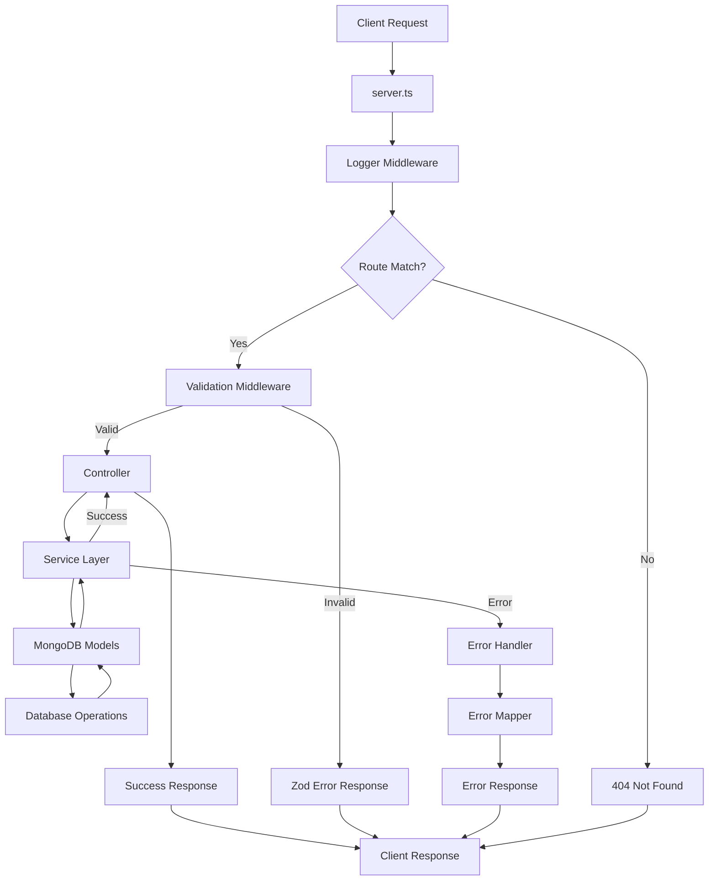

# Project Architecture Flow

## Overview
This document explains the architectural flow of the Node.js/Express/TypeScript application, showing how requests flow through different layers.

## Request Flow Diagram



## Layer Responsibilities

### 1. **Server Entry Point** (`server.ts`)
- Initialize Express app
- Register global middlewares
- Mount route handlers
- Start HTTP server

**Example:**
```typescript
app.use(express.json());           // Parse JSON
app.use(loggerMiddleware);         // Log requests
app.use("/users", userRoutes);     // Mount routes
app.use(errorHandler);             // Catch errors
```

---

### 2. **Middlewares** (`src/middlewares/`)

#### Logger Middleware (`logger.middleware.ts`)
- **When:** Before route handlers
- **Purpose:** Log all incoming requests with method, URL, and timestamp
- **Returns:** Calls `next()` to continue

#### Validation Middleware (`validate.middleware.ts`)
- **When:** Before controller execution
- **Purpose:** Validate request data (body, query, params) using Zod schemas
- **Returns:** Error response if validation fails, otherwise calls `next()`
- **Uses:** `ZodType` for schema validation

#### Error Handler Middleware (`error.middleware.ts`)
- **When:** After all routes (last middleware)
- **Purpose:** Catch and format errors using error mapper
- **Returns:** Formatted error response to client

**Flow:**
```
Request → Logger → Validation → Routes → Controller → Error Handler → Response
```

---

### 3. **Routes** (`src/routes/`)
- **Responsibility:** Define HTTP endpoints and methods
- **Does NOT:** Handle business logic
- **Maps:** HTTP verbs to controller functions with validation middleware

**Example:**
```typescript
import { validate } from '../middlewares/validate.middleware';
import { createUserSchema } from '../schemas/user.schema';

router.get('/', getUsers);                                    // GET /users
router.post('/', validate(createUserSchema), createUser);     // POST /users with validation
```

---

### 4. **Schemas** (`src/schemas/`)
- **Responsibility:** Define validation schemas using Zod
- **Purpose:** Ensure type-safe request validation
- **Used by:** Validation middleware

**Example:**
```typescript
import { z } from 'zod';

export const createUserSchema = z.object({
  body: z.object({
    name: z.string().min(1).trim(),
    email: z.string().email().toLowerCase().trim(),
  }),
});
```

---

### 5. **Controllers** (`src/controllers/`)
- **Responsibility:** Handle HTTP layer (req/res)
- **Tasks:**
  - Extract validated data from `req`
  - Call service layer
  - Handle errors using error mapper
  - Use response handlers to format output

**Example Flow:**
```typescript
import { successResponse, errorResponse } from '../utils/handlers/api-response';
import { mapError } from '../utils/handlers/error-handler';
import * as userService from '../services/user.service';

export const createUser = async (req: Request, res: Response) => {
  try {
    // 1. Extract validated data (validation already done by middleware)
    const { name, email } = req.body;
    
    // 2. Call service
    const newUser = await userService.createNewUser({ name, email });
    
    // 3. Return success response
    successResponse(res, newUser, 'User created successfully');
  } catch (error) {
    // 4. Handle errors
    const { message, statusCode } = mapError(error);
    errorResponse(res, message, statusCode);
  }
};
```

**❌ Controllers should NOT:**
- Contain business logic
- Access database models directly
- Perform manual validation (use middleware)

---

### 6. **Services** (`src/services/`)
- **Responsibility:** Business logic and database operations
- **Pure functions:** No `req`/`res` objects
- **Reusable:** Can be called from multiple controllers
- **Database:** Interacts with MongoDB models

**Example:**
```typescript
import User from '../models/user.model';

export const createNewUser = async (userData: { name: string; email: string }) => {
  // Business logic and database operations
  const user = new User(userData);
  await user.save();
  return user;
};

export const getAllUsers = async () => {
  return await User.find();
};
```

**✅ Services should:**
- Handle business rules
- Perform database operations via models
- Return plain data or model instances
- Throw errors for controllers to catch

**❌ Services should NOT:**
- Touch `req` or `res`
- Send HTTP responses
- Know about HTTP status codes

---

### 7. **Models** (`src/models/`)
- **Responsibility:** Define MongoDB schemas and models
- **Purpose:** Data structure and validation at database level
- **Uses:** Mongoose for MongoDB ODM

**Example:**
```typescript
import mongoose from 'mongoose';

const userSchema = new mongoose.Schema({
  name: { type: String, required: true },
  email: { type: String, required: true, unique: true },
});

export default mongoose.model('User', userSchema);
```

---

### 8. **Utils** (`src/utils/`)
Organized into subdirectories for better structure:

#### Handlers (`utils/handlers/`)

##### API Response Handler (`api-response.ts`)
- Standardize API response format
- Ensure consistency across all endpoints

**Example:**
```typescript
import { successResponse, errorResponse } from '../utils/handlers/api-response';

successResponse(res, data, message);
// Returns: { success: true, message, data }

errorResponse(res, message, statusCode);
// Returns: { success: false, message }
```

##### Error Handler (`error-handler.ts`)
- Maps different error types to user-friendly messages
- Handles MongoDB errors, validation errors, and custom app errors

**Example:**
```typescript
import { mapError } from '../utils/handlers/error-handler';

const { message, statusCode } = mapError(error);
// Returns: { message: 'User-friendly error', statusCode: 400 }
```

#### Constants (`utils/constants/`)

##### Status Codes (`status-codes.ts`)
- Centralized HTTP status code constants
- Prevents magic numbers in code

**Example:**
```typescript
import { StatusCodes } from '../utils/constants/status-codes';

StatusCodes.OK              // 200
StatusCodes.BAD_REQUEST     // 400
StatusCodes.NOT_FOUND       // 404
```

#### Helpers (`utils/helpers/`)

##### Error Functions (`error-functions.ts`)
- Type guards for different error types
- Extract error information

##### Error Classes (`error-classes.ts`)
- Custom error classes for application-specific errors

---

## Complete Request Example

### Scenario: Create a new user

```
1. Client sends POST /users
   Body: { "name": "John", "email": "john@example.com" }

2. server.ts receives request
   ↓
3. Logger Middleware logs the request
   ↓
4. Route matches: POST /users
   ↓
5. Validation Middleware (validate.middleware.ts)
   - Uses Zod schema (createUserSchema)
   - Validates req.body, req.query, req.params
   - If invalid: returns 400 with validation errors
   - If valid: calls next()
   ↓
6. Controller (user.controller.ts)
   - Extracts validated data: { name, email } from req.body
   - Calls: userService.createNewUser({ name, email })
   ↓
7. Service (user.service.ts)
   - Creates new User model instance
   - Saves to MongoDB: await user.save()
   - Returns: User document { _id, name, email }
   ↓
8. Controller receives user from service
   - Calls: successResponse(res, user, 'User created successfully')
   ↓
9. Response Handler (utils/handlers/api-response.ts)
   - Formats response: { success: true, message: "User created successfully", data: {...} }
   - Sends response with StatusCodes.OK (200)
   ↓
10. Client receives response

--- If Error Occurs ---

7b. Service throws error (e.g., duplicate email)
    ↓
8b. Controller catch block
    - Calls: mapError(error)
    ↓
9b. Error Handler (utils/handlers/error-handler.ts)
    - Detects error type (MongoDB duplicate key)
    - Returns: { message: "email already exists", statusCode: 409 }
    ↓
10b. Controller calls errorResponse(res, message, statusCode)
     ↓
11b. Client receives: { success: false, message: "email already exists" }
```

---

## Key Principles

### Separation of Concerns
- **Routes:** Define endpoints and attach validation
- **Schemas:** Define validation rules
- **Middlewares:** Handle cross-cutting concerns (logging, validation, errors)
- **Controllers:** Handle HTTP layer
- **Services:** Business logic and database operations
- **Models:** Database schema definitions
- **Utils:** Reusable helpers organized by purpose

### Single Responsibility
Each layer has ONE job and does it well.

### Dependency Flow
```
Routes → Validation Middleware → Controllers → Services → Models → MongoDB
                                      ↓
                                    Utils
                                  (handlers, constants, helpers)
```

### Why This Architecture?

✅ **Maintainable:** Easy to find and fix bugs  
✅ **Testable:** Each layer can be tested independently  
✅ **Scalable:** Easy to add new features  
✅ **Consistent:** Standardized patterns throughout  
✅ **Reusable:** Services can be used by multiple controllers  

---

## File Structure Reference

```
src/
 ├─ server.ts                        # Entry point, middleware registration
 ├─ config/
 │   └─ database.ts                  # MongoDB connection setup
 ├─ routes/
 │   └─ user.routes.ts               # HTTP endpoint definitions
 ├─ schemas/
 │   └─ user.schema.ts               # Zod validation schemas
 ├─ middlewares/
 │   ├─ logger.middleware.ts         # Request logging
 │   ├─ validate.middleware.ts       # Zod validation middleware
 │   └─ error.middleware.ts          # Error handling
 ├─ controllers/
 │   └─ user.controller.ts           # HTTP request/response handling
 ├─ services/
 │   └─ user.service.ts              # Business logic & DB operations
 ├─ models/
 │   └─ user.model.ts                # Mongoose schemas & models
 └─ utils/
     ├─ handlers/
     │   ├─ api-response.ts          # Response formatting
     │   └─ error-handler.ts         # Error mapping
     ├─ constants/
     │   └─ status-codes.ts          # HTTP status codes
     └─ helpers/
         ├─ error-functions.ts       # Error type guards
         └─ error-classes.ts         # Custom error classes
```
